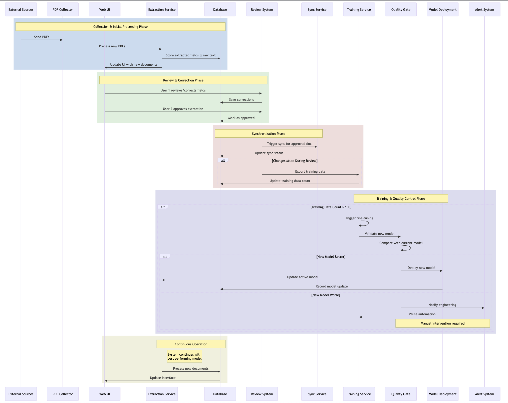
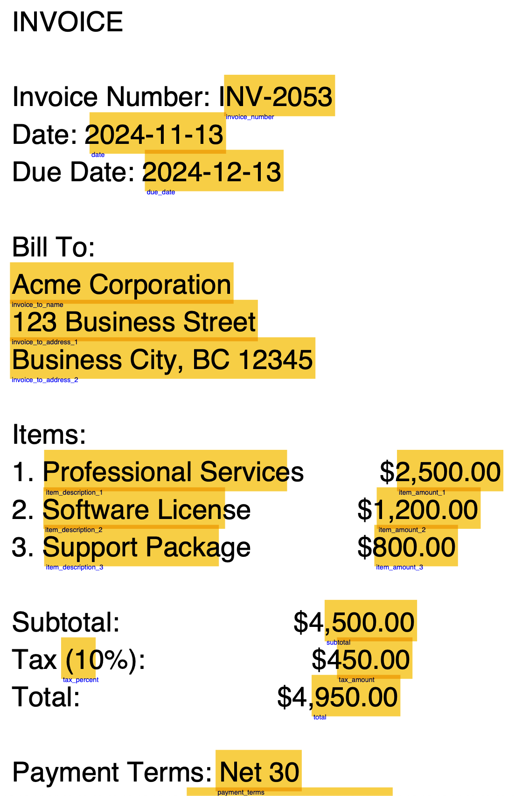

# PDF Data Extraction System with GPT Fine-tuning

A professional PDF data extraction tool using GPT models with support for fine-tuning and validation. The system extracts structured data from PDFs, supports human review, and continuously improves through automated model training.



# Quick POC
Here is a quick POC that allows us to share this with business delivering a practical usable project.
```
+-------------------+       +-------------------+       +-------------------+
|   SharePoint      |       |   Network Location|       |   Scheduler       |
|-------------------|       |-------------------|       |-------------------|
| - XLSX File       |<----->| - input_pdfs      |<----->| - OCR Job         |
| - Extracted Data  |       | - ocred_pdfs      |<----->| - Extraction      |
| - Approved Rows   |       | - output_pdfs     |<----->| - Sync Job        |
+-------------------+       | - input_jsons     |       +-------------------+
                            +-------------------+
                                    ^
                                    |
                                    v
                            +-------------------+
                            |   PDF Extractor   |
                            |-------------------|
                            | - OCR Tool        |
                            | - Extraction Tool |
                            +-------------------+
                                    ^
                                    |
                                    v
                            +-------------------+
                            |   Training System |
                            |-------------------|
                            | - Model Training  |
                            +-------------------+
```

## Project structure
```
├── README.md
├── annotated_pdf.png
├── pdf_extractor
│   ├── init.py
│   ├── cli.py
│   ├── cli_finetune.py
│   ├── sync_to_onedrive.py
│   ├── config
│   │   ├── init.py
│   │   └── extraction_config.py
│   ├── core
│   │   ├── __init__.py
│   │   ├── extractor.py
│   │   └── models.py
│   ├── fine_tuning
│   │   ├── __init__.py
│   │   ├── data_processor.py
│   │   └── trainer.py
│   ├── finetune_commands
│   │   ├── __init__.py
│   │   ├── train.py
│   │   ├── validate.py
│   │   ├── excel2training.py
│   │   └── utils.py
│   ├── services
│   │   ├── __init__.py
│   │   ├── gpt_implementations.py
│   │   ├── gpt_service.py
│   │   └── pdf_service.py
│   ├── utils
│   │   ├── __init__.py
│   │   └── logging.py
│   └── validation
│       ├── __init__.py
│       └── model_validator.py
├── poetry.lock
├── production_pdf_data_extraction_system.png
├── pyproject.toml
└── workflow.mmd
```

## Features

- PDF text and position extraction
- Field identification using GPT models
- Annotated PDF output with highlighted fields
- Field validation and correction UI
- Automated model fine-tuning pipeline
- Model quality validation
- Support for both OpenAI and custom endpoint models

Here's an example of annotated output:



## Prerequisites

- Python 3.8.1 or higher
- Poetry for dependency management
- Node.js (for diagram generation)
- OpenAI API key
- Microsoft Azure App registration (for OneDrive sync)

## Installation

1. Install Poetry if you haven't already:
```bash
curl -sSL https://install.python-poetry.org | python3 -
```

2. Clone the repository:
```bash
git clone https://github.com/yourusername/pdf-extractor.git
cd pdf-extractor
```

3. Install dependencies:
```bash
poetry install
```

4. Activate the virtual environment:
```bash
poetry shell
```

## Configuration

Create a `.config.json` file with your settings:

```json
{
    "ml_engine": {
        "api_key": "your-api-key-here"
    },
    "TENANT_ID": "your-azure-tenant-id",
    "CLIENT_ID": "your-azure-client-id",
    "CLIENT_SECRET": "your-azure-client-secret"
}
```

## Basic Usage

### PDF Data Extraction

1. Prepare your field template (e.g., `invoice_fields_template.json`). If you are keeping a sharepoint excel then you should use the provided utility to create this file.

```bash
create-inference-template <config.json> <sharepoint_excel_shared_link> <document_type> <output_path>
```
This will:

- Connect to SharePoint using Azure App credentials
- Read field definitions from the Excel file
- Create a template JSON with empty values for each field
- Save the template in the specified output path

Example template structure:

```json
{
    "document_type": "invoice",
    "fields": [
        {"key": "invoice_number", "value": ""},
        {"key": "date", "value": ""},
        {"key": "total_amount", "value": ""}
    ]
}
```

2. Run extraction:
```bash
pdf-extractor <config.json> <model_name> <fields_template.json> <input_folder> <output_folder>
```

This will:
- For each pdf in input_folder
- Extract text
- Use a specific GPT model of your choice to identify fields
- Create an annotated PDF with highlighted fields in output_folder
- Save extracted data to JSON in output_folder
- Keep input folder hierarchy in output_folder

3. Syncing Extracted Data to Excel
After extracting data from PDFs, you can sync the extracted fields to a shared Excel file in OneDrive:
```bash
poetry run sync-extracted-fields <config.json> <input_folder> <sharepoint_excel_shared_link>
```
This will:

- Process all JSON files in the input folder that haven't been synced yet
- Connect to OneDrive using Azure App credentials
- Add extracted fields as new rows in the specified Excel file
- Mark processed files as synced to avoid duplication
- Support concurrent Excel access by multiple users

Requirements for Excel sync:

- Azure App registration with appropriate Microsoft Graph API permissions
- Shared Excel file in OneDrive with correct column headers matching field keys
- Network access to Microsoft Graph API endpoints

## Fine-tuning Pipeline

The system includes a complete fine-tuning pipeline for improving model performance.

### Commands

1. List available models:
The system queries OpenAI's API directly to discover available models. You can list available models and check which ones support fine-tuning using:

```bash
pdf-extractor-finetune list-models config.json
```

2. List fine-tuning jobs:
```bash
pdf-extractor-finetune list-jobs config.json
# Optional: Limit number of jobs shown
pdf-extractor-finetune list-jobs config.json 10
```

3. Check job status:
```bash
pdf-extractor-finetune status config.json job-123
```

4. Start model training:
```bash
pdf-extractor-finetune train config.json gpt-3.5-turbo-1106 <json_files_folder> <pdf_files_folder> my-custom-model [--dry-run]

5. Validate model performance:
```bash
pdf-extractor-finetune validate <config.json> <training_dir> <model_name> <template_path> [error_limit]
# Example:
pdf-extractor-finetune validate config.json ./training_dir "ft:gpt-3.5-turbo-1106:mycompany:my-model-name:id" ./my-template.json
# Optional: Set error example limit
pdf-extractor-finetune validate config.json ./training_dir "ft:gpt-3.5-turbo-1106:mycompany:my-model-name:id" ./my-template.json 10
```
6. Pull approved data from excel into training json data 
```bash
pdf-extractor-finetune excel2training <config.json> <json_files_folder> <pdf_files_folder> <sharepoint_excel_shared_link>
```
### Training Data Structure

Your training directory should contain PDF files and their corresponding JSON files with verified field extractions:
```
training_dir/
├── .cache/                         # Cache directory for individual examples
│   ├── doc1_training.json         # Cached training data for doc1
│   └── doc2_training.json         # Cached training data for doc2
├── doc1.pdf                       # Source PDF document
├── doc1.json                      # Verified field extractions for doc1
├── doc2.pdf                       # Source PDF document
├── doc2.json                      # Verified field extractions for doc2
└── training_20240114_123045.json  # Timestamped training file for OpenAI
```

The JSON files should have this structure:
```json
{
    "fields": [
        {"key": "invoice_number", "value": "INV-2024-001"},
        {"key": "date", "value": "2024-01-14"},
        {"key": "total_amount", "value": "1,234.56"}
    ]
}
```

The system implements a caching mechanism to optimize processing:
- Individual examples are cached in `.cache/` directory
- Cache is only rebuilt if source files (PDF or JSON) are modified
- Final training file is timestamped and only rebuilt if cache files change
- System maintains last 5 training files for history
- Model names include training file timestamp for version tracking

Note: While templates are used for inference to specify which fields to extract, they are not needed for training. The training process learns from the actual field extractions in the JSON files.

## Automated Workflow

The system supports an automated workflow where:
1. PDFs are processed using current best model
2. Users review and correct extractions
3. Corrected data is saved for training
4. When >100 new corrections accumulate, fine-tuning triggers
5. New model is validated against previous model
6. Better models are automatically deployed

## Development

### Project Structure
```
.
├── pdf_extractor/
│   ├── cli.py              # Main CLI
│   ├── cli_finetune.py     # Fine-tuning CLI
│   ├── config/             # Configuration handling
│   ├── core/               # Core extraction logic
│   ├── fine_tuning/        # Fine-tuning pipeline
│   ├── services/           # GPT and PDF services
│   ├── utils/              # Utilities
│   └── validation/         # Model validation
```

### Generate Documentation Diagrams

1. Install Mermaid CLI:
```bash
npm install @mermaid-js/mermaid-cli
```

2. Generate workflow diagram:
```bash
npx @mermaid-js/mermaid-cli -i workflow.mmd -o workflow.svg
```

## Contributing

1. Fork the repository
2. Create a feature branch
3. Make your changes
4. Submit a pull request

## License

MIT

